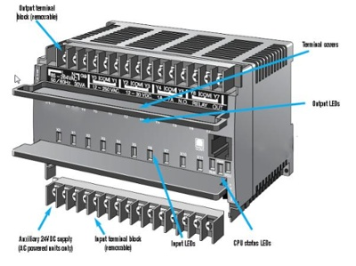
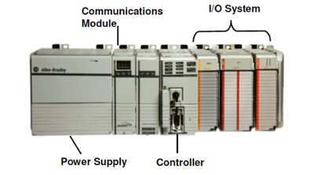

# Industrial Automation
Industrial automation is the use of control systems, such as computers or
robots, and information technologies for handling different processes and
machineries in an industry to replace a human being.
 
 

### **Home Automation**

Home automation system will monitor and control home attributes such as
lighting, climate, entertainment systems, and appliances. It may also
include home security such as access control and alarm systems. When
connected with the Internet, home devices are an important constituent
of the Internet of Things ("IoT").

Some of the home automation products are Alexa, Ring, Philips Hue, Honeywell.

Direct Digital Controller ("DDC") are widely used controllers in home 
automation systems.
 
 

### **Industrial Automation**

Industrial Automation is the use of control systems, including machines, actuators,
sensors, processors, and networks to perform tasks, with the goal of automating 
production line in a factory/Industry.

Machines performed basic tasks and work that reduced manual labor. Today, industrial 
automation is a wide range of machines, actuators, sensors, processors, and networks
that work to connect an industrial environment.

*Programmable Logic Controller* (PLC) and Distributed *Control System* (DCS) are widely
used controllers in Industrial automation systems.
 
 

### **Types of PLC**
1. Fixed PLC
2. Modular PLC
3. Rack mount PLC
 
 
- #### **Fixed PLC**

Fixed automation often has a set task, continuous workflow, and large volume production.
This type of industrial automation rarely sees changes.  For example a car park barrier,
this would not use many inputs/ outputs and would only require a simple program.

``Appropriate for fixed input and fixed output(suitable for single/specific application)``
 
 

 
 

- #### **Modular PLC (Unitary)**

Modular PLC allows multiple expansions of the PLC system through the use of modules
that can be slotted together to build up a system, hence the term “modular”.

Modules give the PLC additional features like increased number of I/O units, and
they are usually easier to use because each component is independent of each other.

The power supply, communications module, Input/Output module are all separate to the
actual microcontroller so you have to manually connect them to each other to create
your PLC control system.

``Suitable for fexible input and output devices (scalable)``
 
 

 
 

- #### **Rack mount PLC**

The design and characteristics of a rack mounted system are very similar to a modular
system however these modules are on standard cards which then slot together into a
rack inside a control cabinet. These modules communicate via the rack.

Like the modular PLC this type of system is widely used in the manufacturing industry.
This is mainly because of the amount of input/output points that the system can contain
but also because it has the ability to communicate with other networks.

``Configurable on hardware level``
