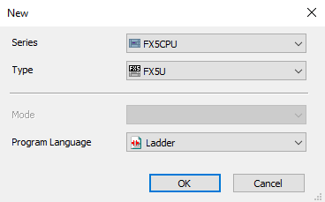
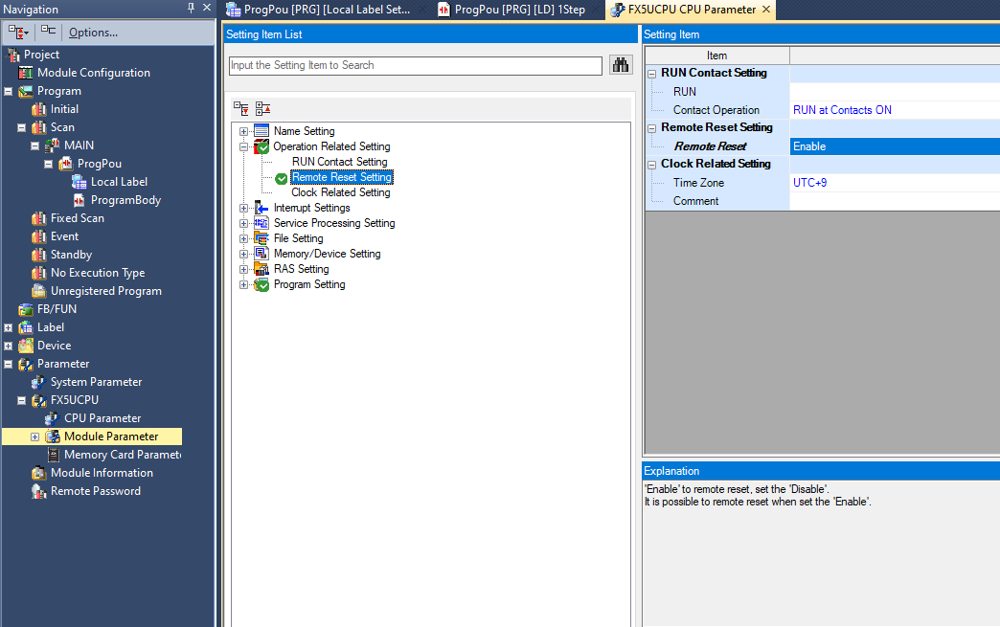
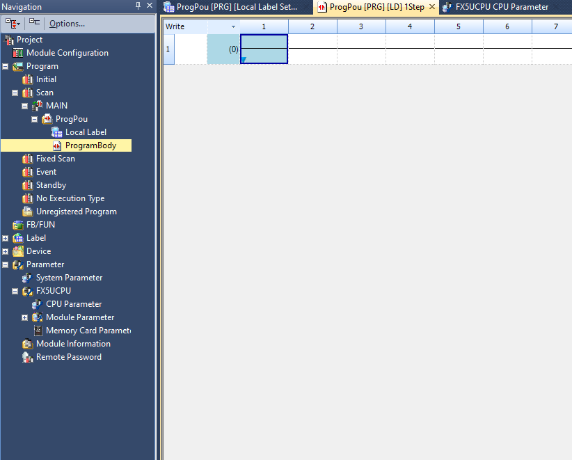
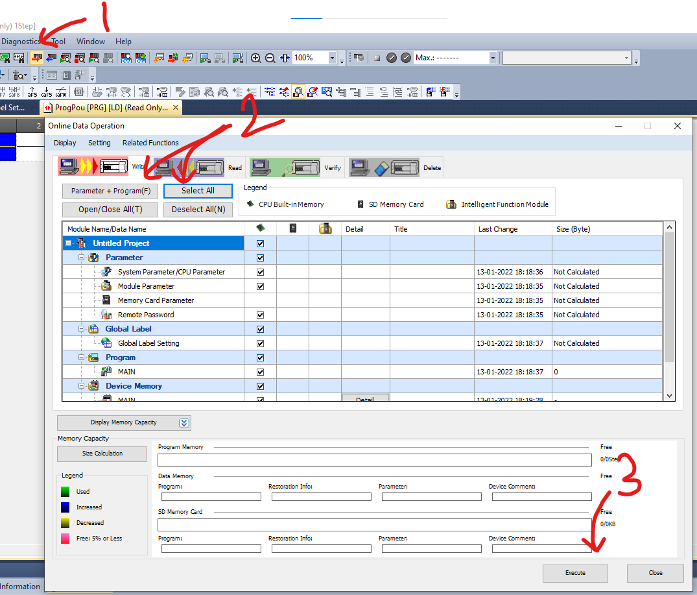
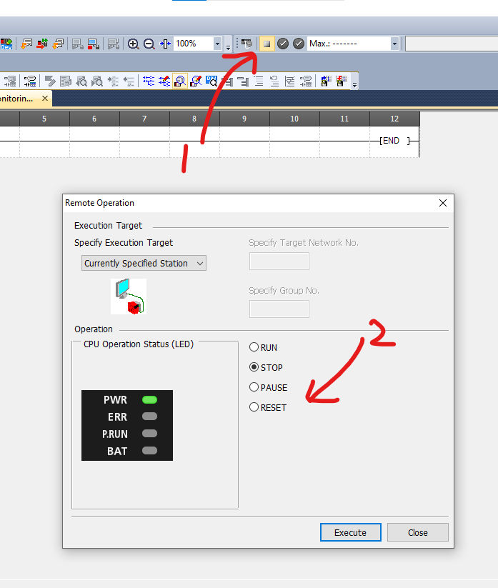
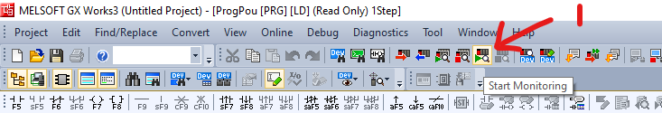
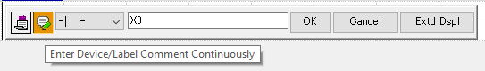
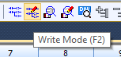

# Getting started

The software in discussion is GX works 3 since we are using an FX series controller for testing. If you are working with Q series controllers use GX works 2.

### Create new project

```
project -> new 
```
- select the CPU series 
- select the model type
- then select the programming language



<br>
PLC can be programmed with languages such as Ladder diagram, Function block diagram, Sequential flow chart, Instruction list, Structural text.

### Enable remote reset 

To reset the controller from GX works, while downloading a new program to the controller, you need to enable remote reset.

```
navigation -> parameter -> fx 5u cpu -> cpu parameter -> operation related setting -> remote reset setting -> enable
```



### Programing Tab

The program resides in the program body

```
naviation -> program -> scan -> main -> ProgPou -> programbody
```



### Convert

To compile the program on ProgPou (Program Optimization Unit), which comprises of program body and local labels, to need to convert the program

```
convert -> convert(B) or press F4
```

### Write to PLC

After completing the program and converting it, the next part will be uploading the code to PLC. This can be called downloading to PLC depending on the manufacturer because everything in IDE is written from a PLC perspective.

```
write to plc -> parameter+program/select all -> execute
```



<br>

'Select all' to upload comments too which is recommended for ease of understanding for other programmers while working on plc 

### Read from PLC 

To download the program on the controller to the software for inspection or improvement.

```
read from plc -> parameter+program/select all -> execute
```

### Remote operation

To remotely start, stop and reset the controller after uploading a new program
```
CPU operation status -> (operation) -> execute
```


### Monitor

To monitor the current status of the PLC, Select **Start Monitoring** under the **Program Common** tab



<br>

### Continuous commenting

Enabling 'device comment continuously' will ask you to add comment for each component after they are assigned to a port automatically. It is recommnend since adding comment(device name) to each component will help to identify port assigned to a component easily.



<br>

### Write mode

Check whether you are in write mode after simulation or run, You have to be in write mode to edit the program.



<br>

- To know more read the GX works3 [Operating Manual](https://ie3a.mitsubishielectric.com/fa/en/dl/10994/sh081215.pdf)