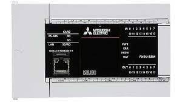
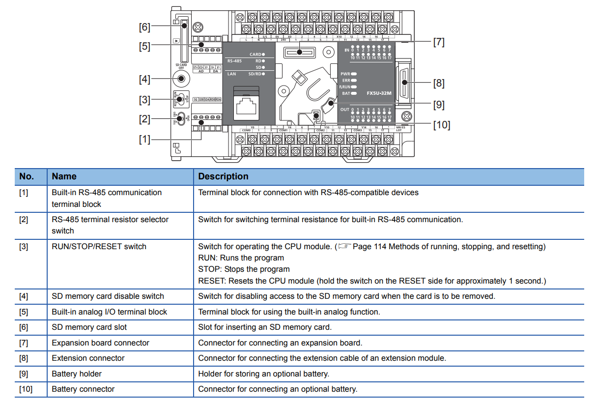
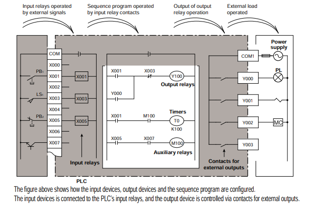
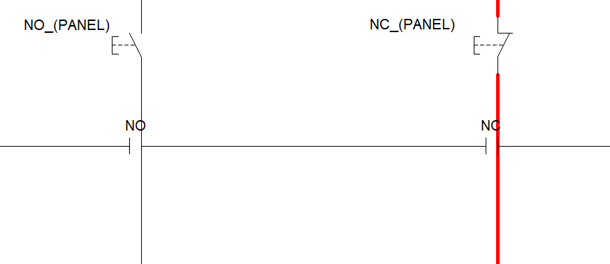

# MITSHUBISHI Programmable Logic Controller

We are starting off with PLC controller from Mitshubishi. 

- Mitshubishi offer 2 types of plc controllers mainly,
    - Q series (rack type)
    - fx series (modular type)

The software offered by Mitshubishi to program their products called GX works
- GX work 2 for Q series and older models 
- GX work 3 for FX series

----

For training, we used Model FX - 5u; which is a compact 24V DC PLC controller with 16 input and 16 output ports and output ports were relay type, which means output from plc can be DC or AC depending on power supply connected to output common port.

 

### Outline

 

### Internal configuration

 
 

As the figure above shows contacts in ladder programs are triggered by power at input port which is independent of type of contact used to keep the input port high/low.

Which means a stop button on the panel which is normally closed is mentioned as normally open contact in program. This could be confusing as the way i like to put to imagine the contact on panels are perpendicular to contacts on program which are triggered only when current passes through them as the figure below shows.

 
Since the NC from panel is already triggering the port on the controller using a NO in the programming will operate as circuit as designed 

 

| contact on panel | contact used in program to represent it | result of the circuit (normally) |
| :---: | :---: | :---: |
|   NO  |   NO  |  off  |
|   NO  |   NC  |  on   |
|   NC  |   NO  |  on   |
|   NC  |   NC  |  off  |

[For the puposes for understanding since wiring configuration may vary depending on the circuit configuration I have NC and NO in programs without considering the button on panel, therefore makes changes to the code according to the contact on panel.]

 

In Mitshubishi, input ports are represented / labelled as X0, X1, X2, X3, .... and output ports are represented / labelled as Y0, Y1, Y2, ....

