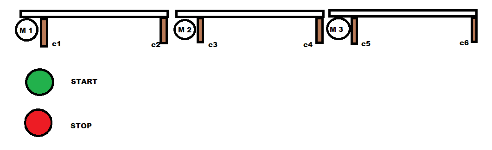
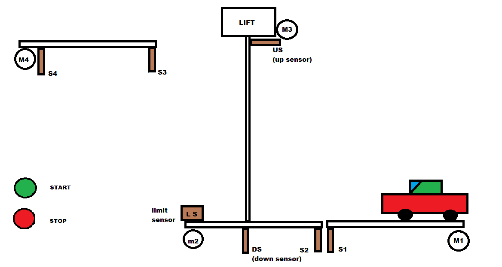

# Problem statements
---
#### Problem 1

- start -> motor 1 
- stop -> all stop

---

#### Problem 2

- Design a automated car parking system
- The goal is to park the vechile and bring the elevator back to level 1

---

