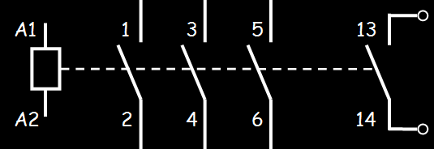
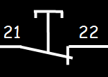
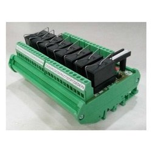

# **Components**
Here you can see schematic symbol followed by module pictures for each components

- ## **FUSE**

Fuse is anelectrical safety device that protects load from over current. when too much current follows through the strip/wire in the fuse it melts, thereby cutting the connection between source and drain.

 

 

- ## **ISOLATOR**

Isolator switch sets apart electrical circuit from the main power source so that repair works can be carried out, basically it works as a switch.

 

 

- ## **MINATURE CIRCUIT BREAKER**

MCB is a electrical switch that interrupts power supply to the load when excess current drawn, In nutshell MCB works as both fuse and isolator.

 

 

- ## **CONTACTOR**

 

 

 

- ## **NORMALLY OPEN SWITCH**

NO switches are always disconnected (open) unless it is activated. In this case NO push button does not conduct unless the button is pressed.

 

 

- ## **NORMALLY CLOSED SWITCH**

NC switches are always connected (closed) unless it is activated. In this case NC push button conducts untill the button is pressed.

 

 

- ## **TIMER**

 

 

- ## **RELAY**

 

 

- ## **OVER LOAD RELAY**

 

 

- ## **SENSORS**

 

 

- ## **POWER SUPPLY UNIT**

 

 

- ## **BREAKOUT BOARD**

 

 