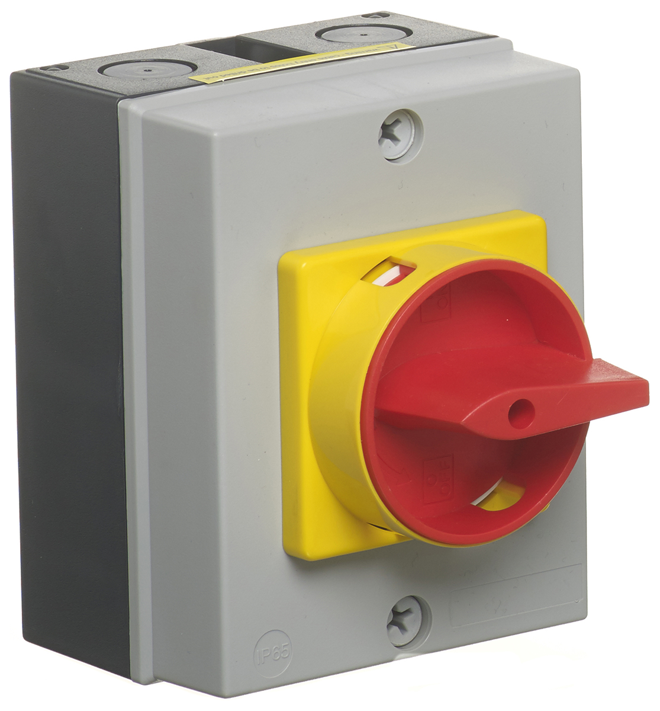
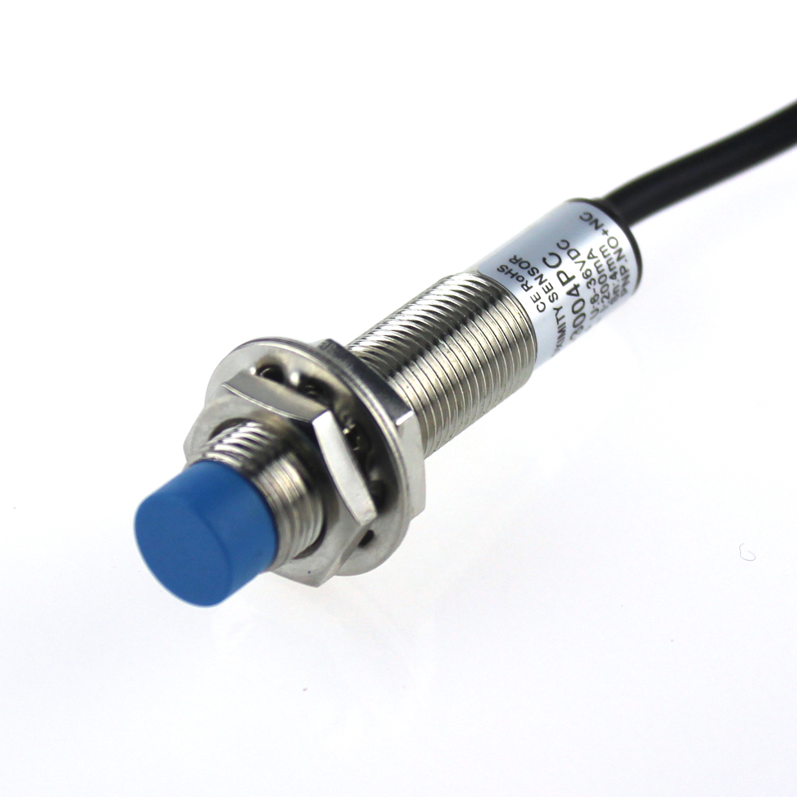

# **Components**
Here you can see schematic symbol followed by module pictures for each components

- ## **FUSE**

Fuse is anelectrical safety device that protects load from over current. when too much current follows through the strip/wire in the fuse it melts, thereby cutting the connection between source and drain.


<br>


<br>

- ## **ISOLATOR**

Isolator switch sets apart electrical circuit from the main power source so that repair works can be carried out, basically it works as a switch.


<br>



<br>

- ## **MINATURE CIRCUIT BREAKER**

MCB is a electrical switch that interrupts power supply to the load when excess current drawn, In nutshell MCB works as both fuse and isolator.


<br>


<br>

- ## **CONTACTOR**

Contactor is used fro switching an electrical power circuit, it acts like a relay for 3-phase AC load like motor


<br>


<br>


<br>

- ## **NORMALLY OPEN SWITCH**

NO switches are always disconnected (open) unless it is activated. In this case NO push button does not conduct unless the button is pressed.


<br>


<br>

- ## **NORMALLY CLOSED SWITCH**

NC switches are always connected (closed) unless it is activated. In this case NC push button conducts untill the button is pressed.


<br>


<br>

- ## **TIMER**

A timing relay is a simple form of time-based control, which opens or closes the contacts based on a specified timing function.

ON delay timers turn on the load after the specified time, whereas OFF delay timers cuts the power to the load only after the specified delay time.


<br>


<br>

- ## **RELAY**

Relays are electrically operated switches that allow one electrical circuit to control one or more other circuits by opening and closing its contacts in response to energizing or de-energizing its coil. 


<br>


<br>

- ## **OVER LOAD RELAY**

Thermal overload relay provides protective features for 1 or 3 phase motors. The relay monitors the operating current of the motor and switched the contactor off, in the event of an overload situation.


<br>


<br>

- ## **SENSORS**

Sensors are devices that either measures a physical quantity or detects it.

In PLC automation, a sensor must be a transducer who can convert a physical quantity into an electrical quantity.

There are two types of sensors used in PLC Automation: Analog and Digital:

#### Types of sensors based on output
- Analog sensors : 

    Analog sensors are devices that output a continuous voltage linear to the experienced change in the environment. They are used in temperature sensing, distance sensing, and pressure sensing

    In PLC automation, the typically used analog inputs vary from 0-20mA, 4-20mA, or 0-10V. Hence, the sensing may also become current sensing or voltage sensing.

- Digital sensors :
  
    Digital sensors are the device which gives outputs in a status HIGH or in a status LOW voltage only. This devices working on principle of binary number system where output will be measured in 0 and 1 which can be represent LOW and HIGH, respectively.

```
In control circuit diagrams digital sensors are mentioned as open switches
```



<br>