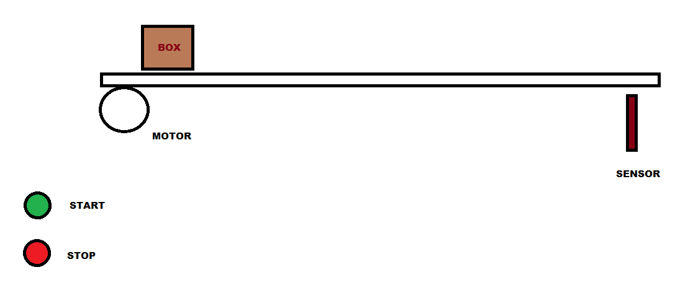
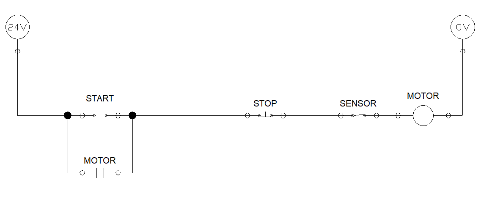
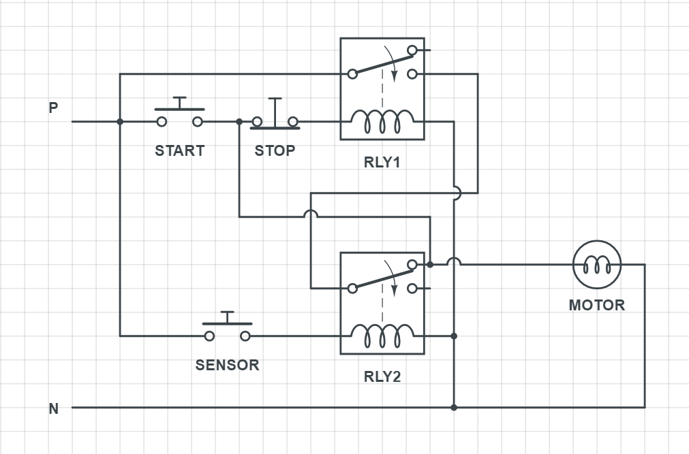

# CONVEYOR BELT - 1

Design a control circuit to operate a conveyor belt which can be started and stoped at anytime with 'Start' and 'Stop' buttons. The conveyor should stop operating when it detects a box/package at the end of the line (refer the figure below)

----

### Control circuit - one line diagram

### Control circuit schematic diagram

 

When the sensor is high or the stop button is pushed to unlatches the 1st relay, thereby resetting the entire circuit to original state (OFF).