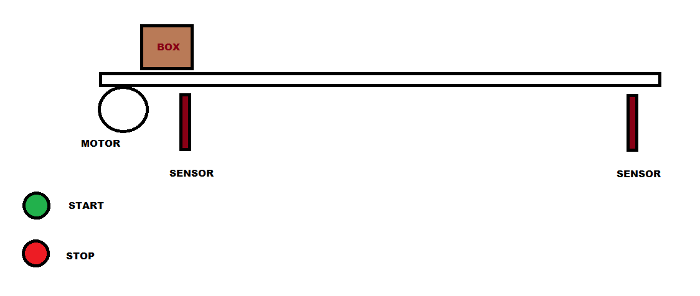
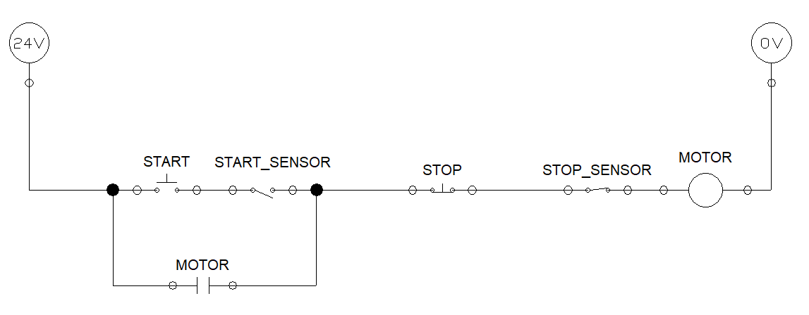
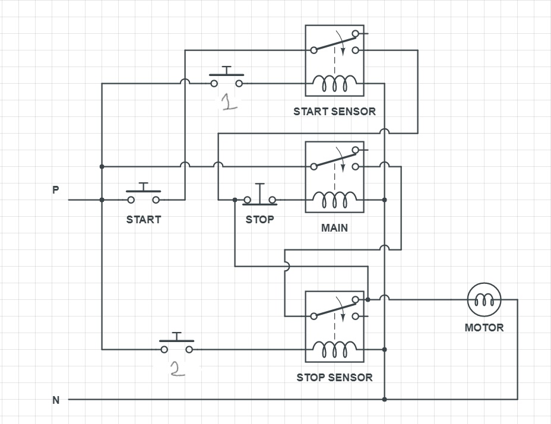

# CONVEYOR BELT - 2

Design a control circuit to operate a conveyor belt which can be started and stoped at anytime with 'Start' and 'Stop' buttons.
- The conveyor should stop operating when it detects a box/package at the end of the line 
- Start again only when operator presses the start and a box is placed at the start of the conveyor (refer the figure below)

----

### Control circuit - one line diagram

### Control circuit schematic diagram

START sensor and START button are in series (i.e in AND logic), Therefore both of them should be triggered to activate the motor.