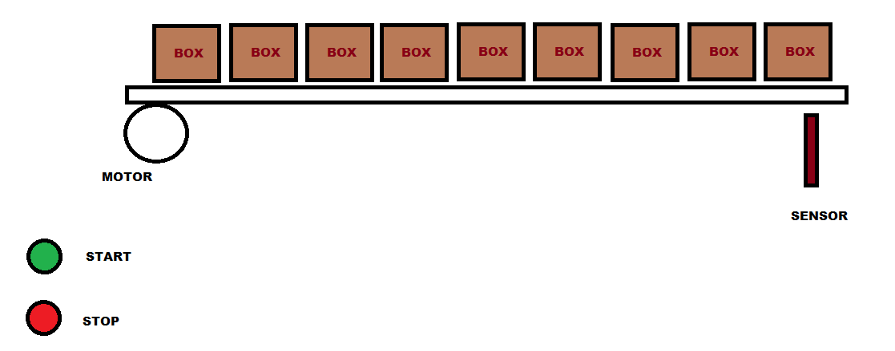
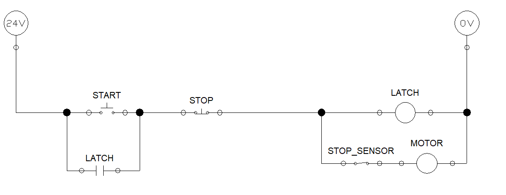
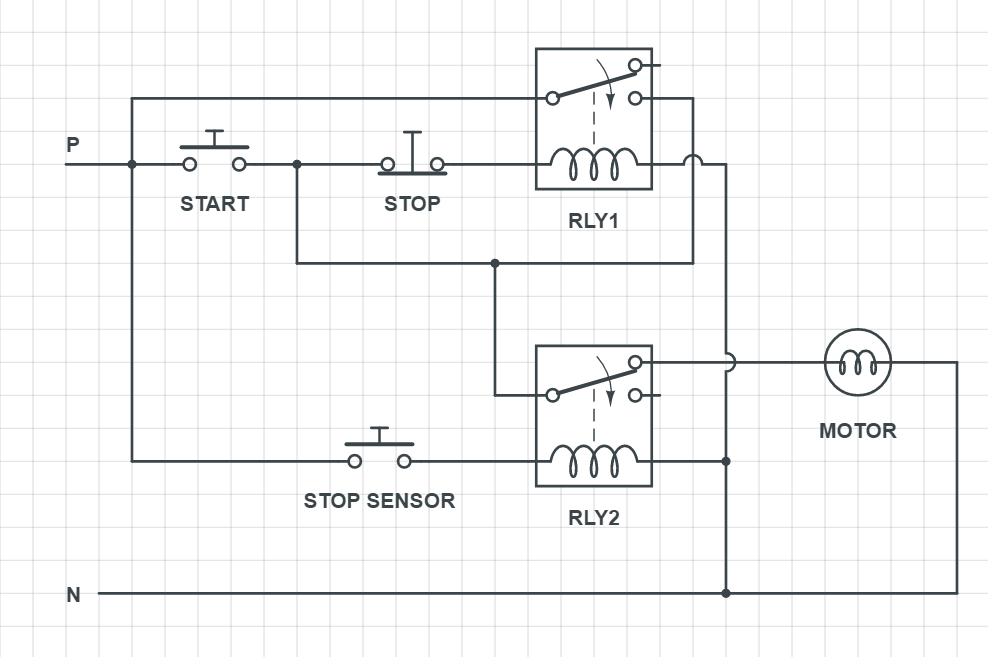

# CONVEYOR BELT - 3

Design a control circuit to operate a conveyor belt which can be started and stoped at anytime with 'Start' and 'Stop' buttons.
- The conveyor should stop operating when it detects a box/package at the end of the line 
- Start again without any human intervention till it detects next box, this process should continue. (refer the figure below)

----

### Control circuit - one line diagram

### Control circuit schematic diagram

 

Conveyor starts moving when START button is pressed and continues to move untill STOP button is pressed. The motor pauses when STOP sensor is triggered (detects a box) but latch is not disconnected, Therefore when the object is removed the conveyor continues to move.