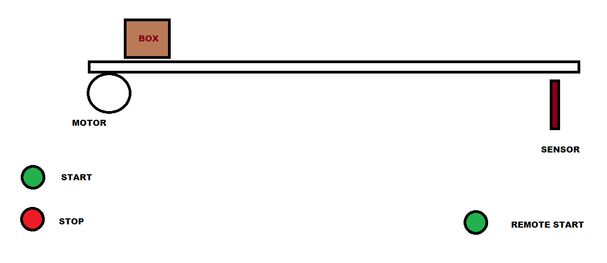
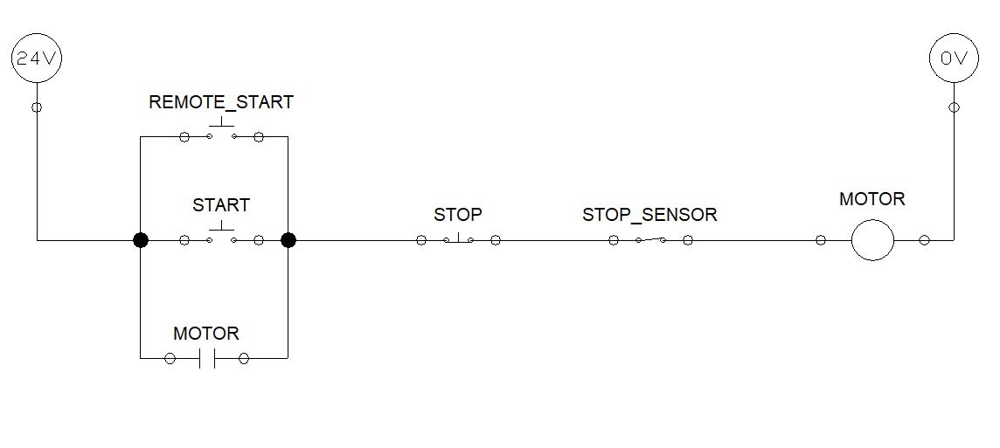
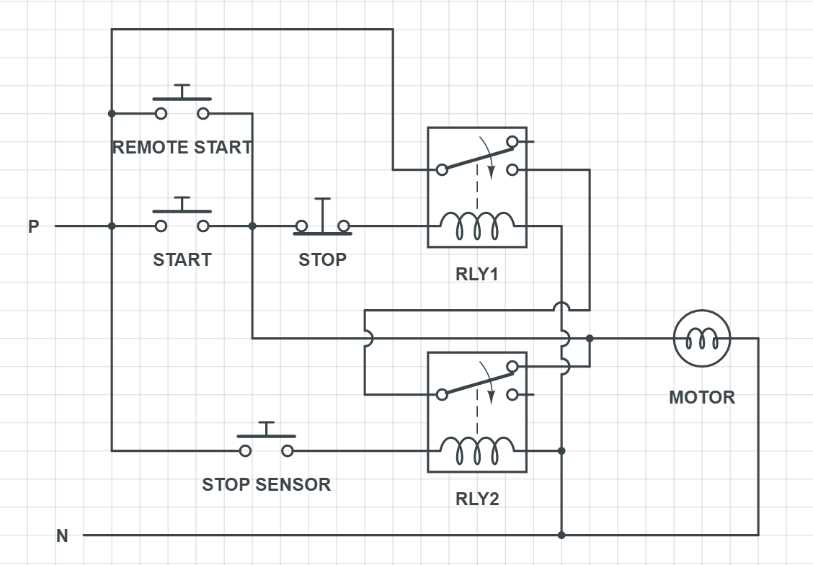

# CONVEYOR BELT - 4

Design a control circuit to operate a conveyor belt which can be started and stoped at anytime with 'Start' and 'Stop' buttons.
- The conveyor should stop operating when it detects a box/package at the end of the line 
- It should be also able to start/restart from button on remote panel. (refer the figure below)

----

### Control circuit - one line diagram

### Control circuit schematic diagram

 

START button and REMOTE START button are in paraller (i.e OR logic), Therefore triggering either of the buttons will activate the circuit.