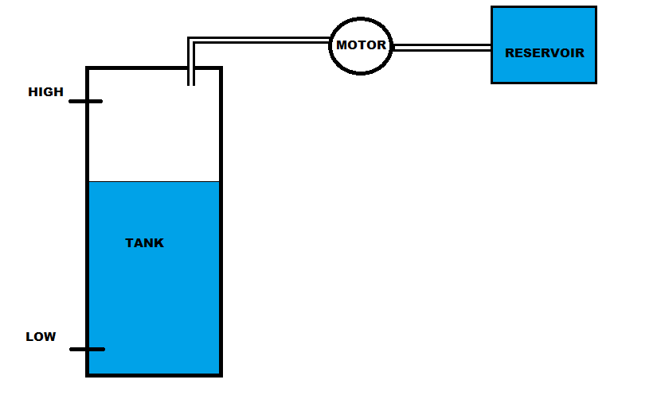
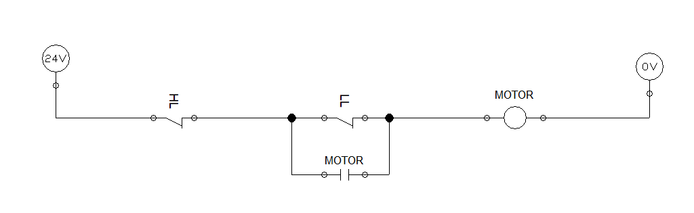
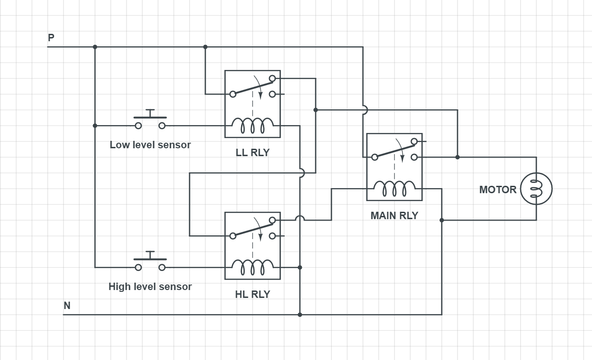

# WATER LEVEL

Design a control circuit to operate a refilling pump of a reservoir which should be started and stoped automatically with help of level sensors.
- The water pump should start refilling when the level below set low point
- It should stop refilling at set high point. (refer the figure below)
- Sensors are positioned at high and low level points.

----
### TRUTH TABLE

| HL | LL | M  |
|:--:|:--:|:--:|
| 0  | 0  | 1  |
| 0  | 1  | 0 - dropping / 1 -refilling |
| 1  | 1  | 0  |

0 - not triggered/OFF 1 - triggered/ON 
HL - high level sensor LL - low level sensor

### Control circuit - one line diagram

### Control circuit schematic diagram

 