# LOGIC GATES WITH RELAY

- The building blocks of a digital circuit are logic gates, which execute numerous logical operations that are required by any digital circuit. These can take two or more inputs but only produce one output.

- Combination of these logic circuits can give output for any condition given.

**NOTE :**  In the truth tables below 1 indicates the switch is triggered and 0 indicates the swtich is not triggered.

Triggered is different from ON/OFF state, here both Normally Open and Normally Closed switches are not triggered -> 0

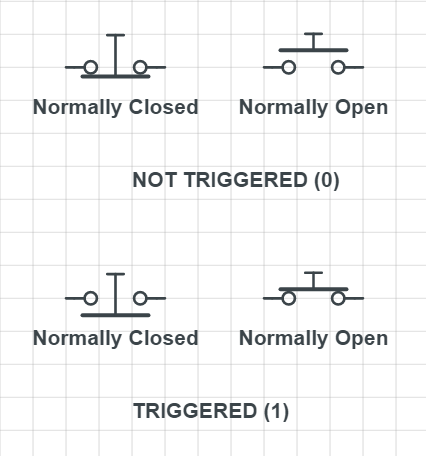

---

## AND 

TRUTH TABLE 

|X|Y|Z|
|-|-|-|
|0|0|0|
|1|0|0|
|0|1|0|
|1|1|1|

CIRCUIT LOGIC

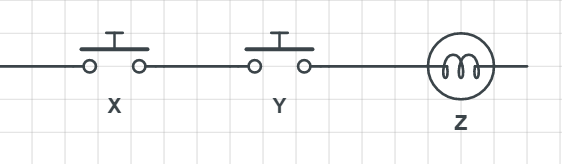

 

RELAY LOGIC

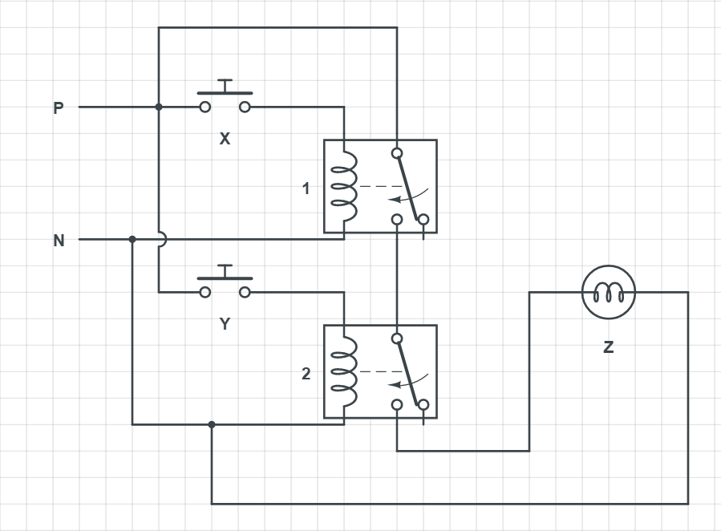

## OR 

TRUTH TABLE 

|X|Y|Z|
|-|-|-|
|0|0|0|
|1|0|1|
|0|1|1|
|1|1|1|

CIRCUIT LOGIC

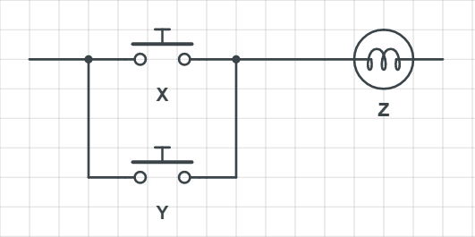

 

RELAY LOGIC

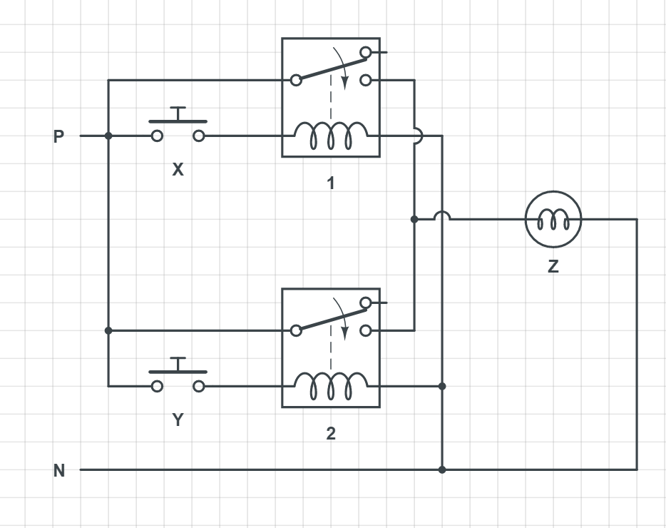

## NAND 

TRUTH TABLE 

|X|Y|Z|
|-|-|-|
|0|0|1|
|1|0|1|
|0|1|1|
|1|1|0|

CIRCUIT LOGIC

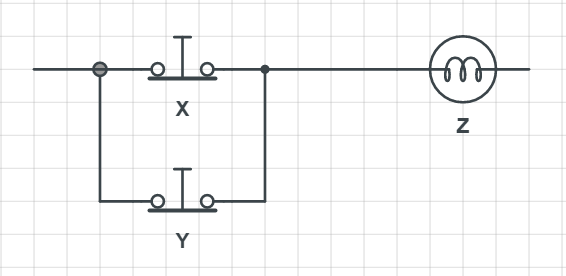

 

RELAY LOGIC

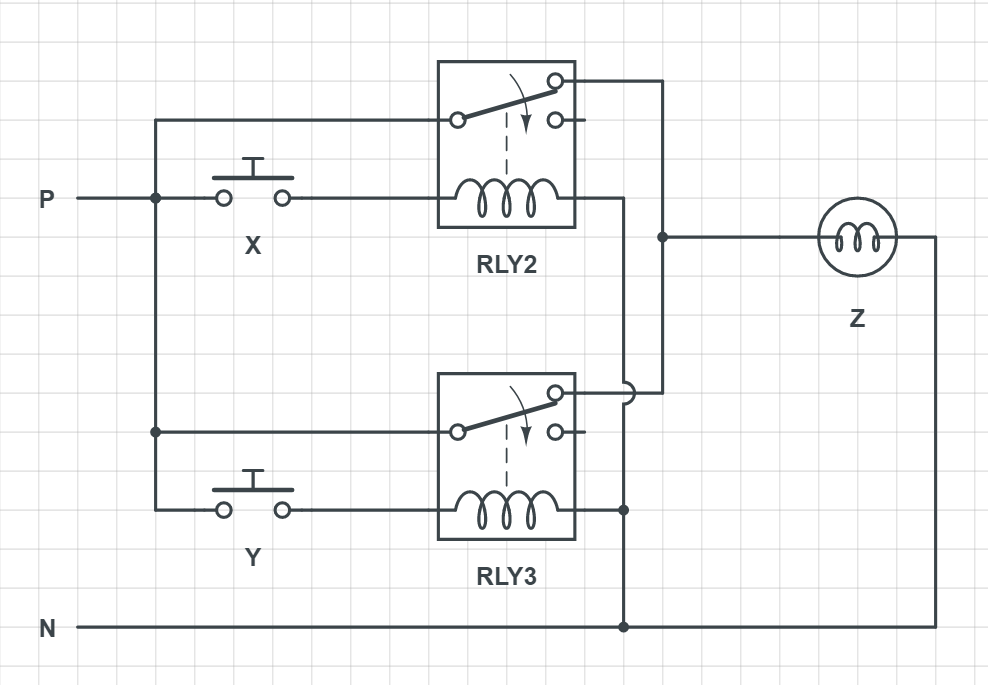

## NOR 

TRUTH TABLE 

|X|Y|Z|
|-|-|-|
|0|0|1|
|1|0|0|
|0|1|0|
|1|1|0|

CIRCUIT LOGIC

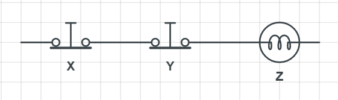

 

RELAY LOGIC

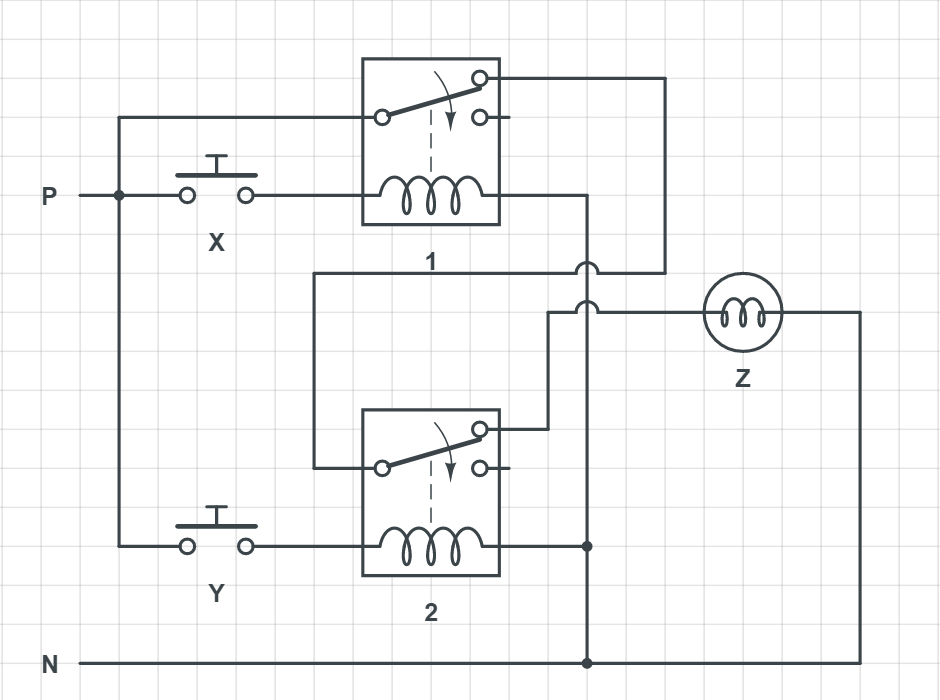

## XOR

TRUTH TABLE 

|X|Y|Z|
|-|-|-|
|0|0|0|
|1|0|1|
|0|1|1|
|1|1|0|

CIRCUIT LOGIC

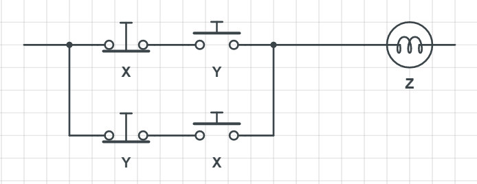

 

RELAY LOGIC

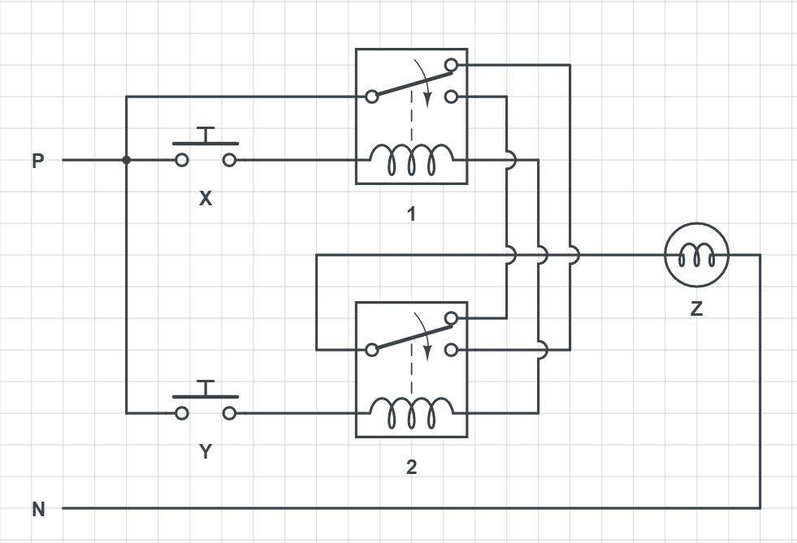

## XNOR

TRUTH TABLE 

|X|Y|Z|
|-|-|-|
|0|0|1|
|1|0|0|
|0|1|0|
|1|1|1|

CIRCUIT LOGIC

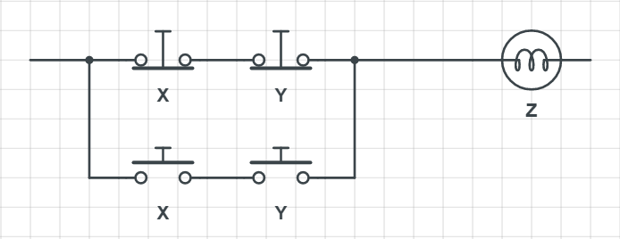

 

RELAY LOGIC

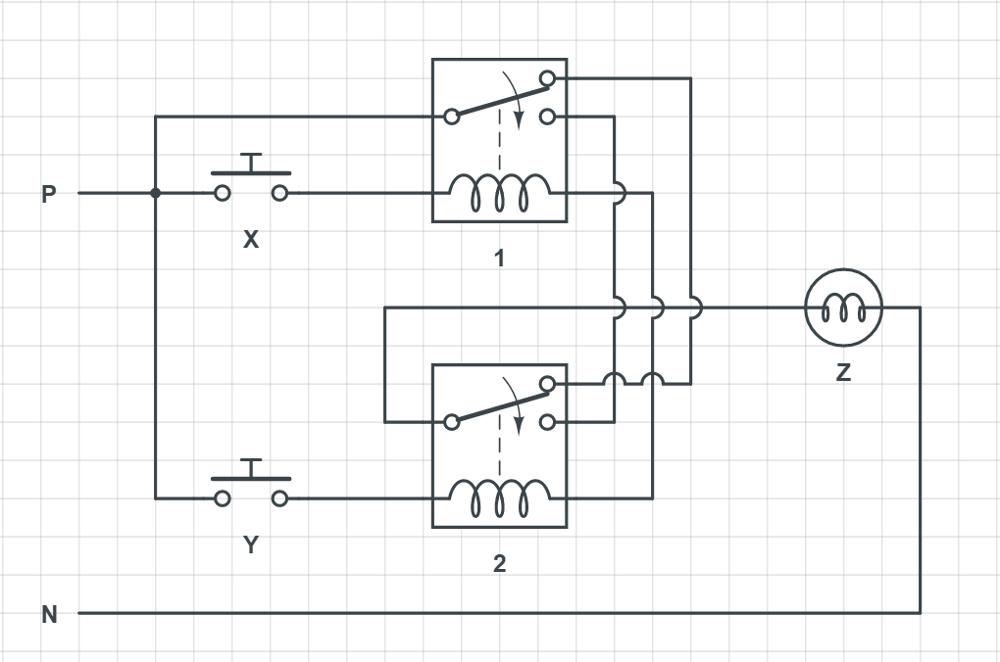