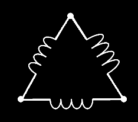
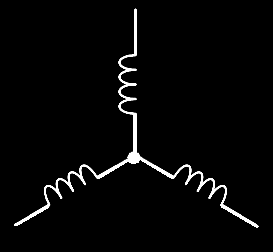

# **STARTERS**

- A starter is a devise that controls the use of electrial power to equipment,
usually a motor. As the name implies, starters "start" motors. They can also stop
them, reverse them, and protect them.Starters are made from two building blocks,
Contactors and Overload Protection.

 

### **Necessity of motor starter**
 

- A starter is needed for a three phase induction motor because at the time of
starting, if induction motor is started directly, it will draw large amount of
current which causes damage to adjoining equipments.

- Thus, a starter is needed in order to limit the starting current. After the
motor has started at reduced starting current and hence reduced voltage, the
connections are diverted towards the mains supply so that now, the motor can
run at higher starting current and voltage.

 

## **Types of starters**
 

- Star-Delta
- Auto transformer method
- Primary resistor string
- Direct on-line

## **Starter configurations**

- #### **DELTA CONFIG**

- #### **STAR CONFIG**

